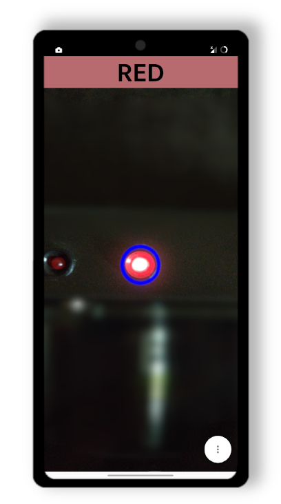
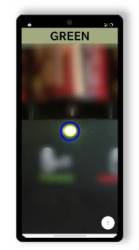
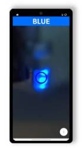
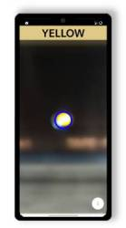

<h1 align="center">LED Color Detector for Colorblind</h1>

This app makes it easy to identify colors of red, green, blue and yellow LEDs and is therefore ideal for color blind people. For the best possible detection, the blue circle should be just above the LED. The color will then be displayed as text.

## Screenshots

## Features
* Easy identification of red, green, blue and yellow LEDs
* Output of the color as text

## Special
* no advertising
* only necessary permissions

## Thanks to
* [Camera Color Picker](https://github.com/tvbarthel/CameraColorPicker)

## Permissions
* CAMERA: Explains itself :-)

If you have any comments, please let me know.
